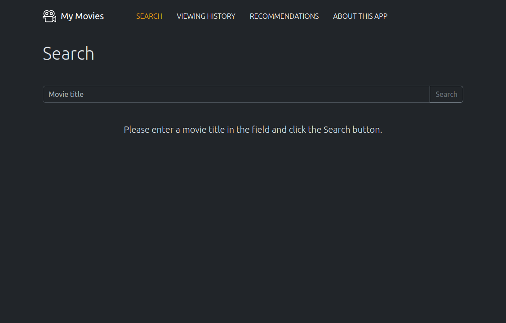
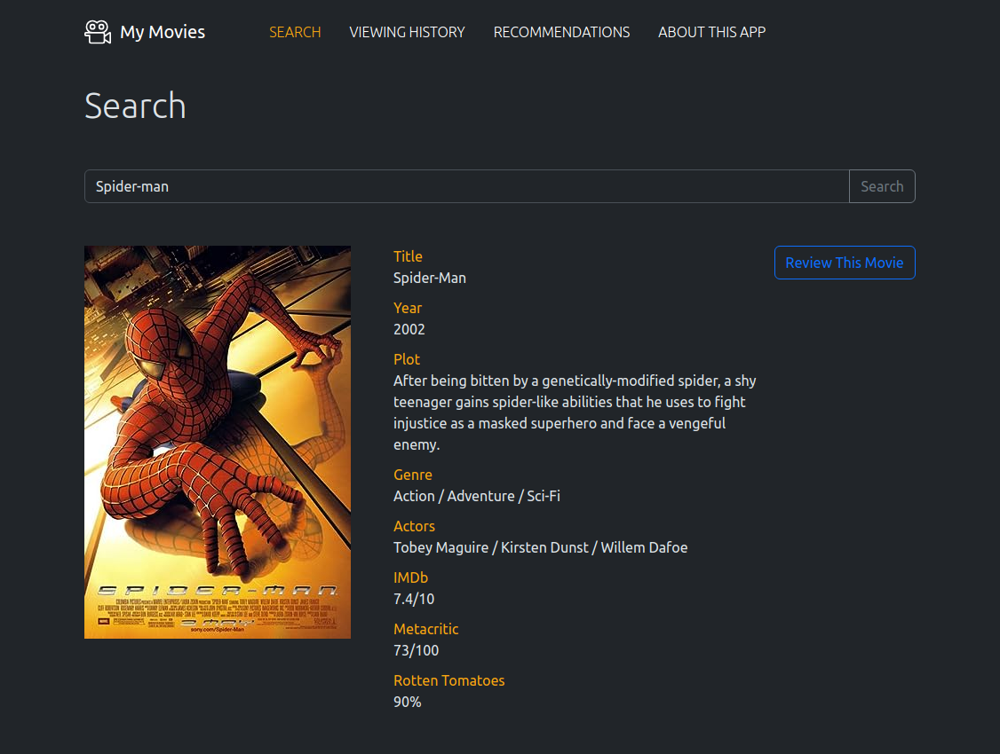
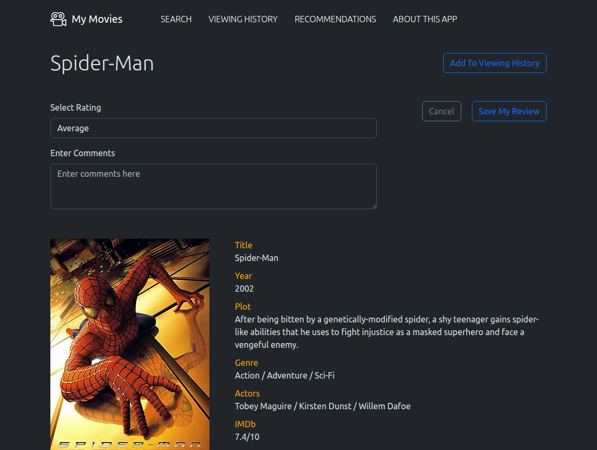
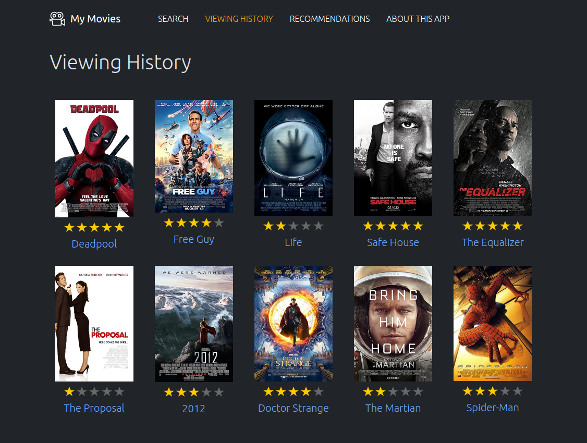
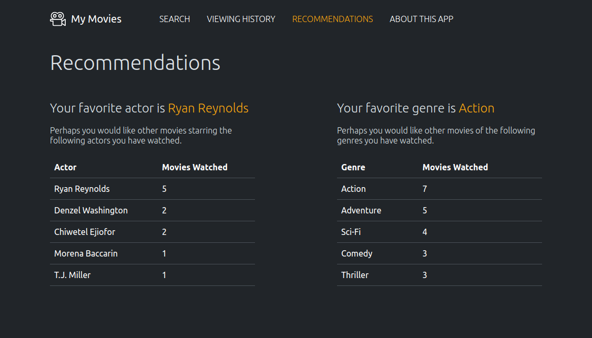
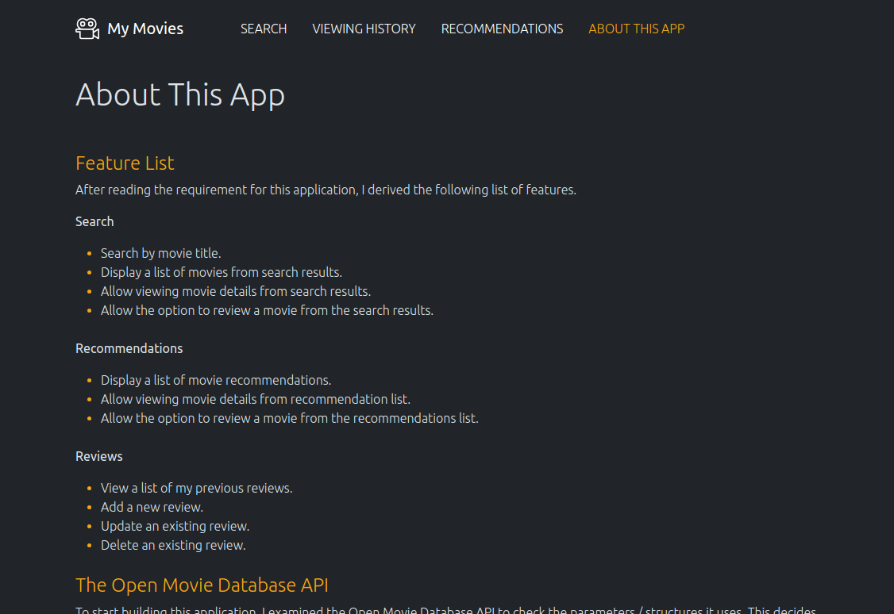

# My Movies
This is a simple Single-Page Application which allows a user to review movies and keep track of their watch history. It also provides recommendations to the user based on the actors and genres of the movies they have already watched.

## Starting the app
After cloning the repo, from the **my-movies** directory, run `npm install` and then `npm start`.
This will run the app in development mode.
Open [http://localhost:3000](http://localhost:3000) to view it in a browser.

## Sample user flow
1. Start on the Search page.
2. Enter the title of a movie (the search term must match the title exactly) then click the **Search** button.
3. View the movie details at the bottom of the page.
4. Click the **Review This Movie** button.
5. From the movie page, click the **Add My Review** button.
6. Select a rating for the review.
7. Enter a comment into the text area.
8. Click the **Save My Review** button.
9. Click on the **Viewing History** link in the header.
10. The movie and review will appear in the viewing history.

## Detailed information
- This project was bootstrapped with [Create React App](https://github.com/facebook/create-react-app).
- To help show the app operations, a list of movies and dummy reviews are automatically loaded into local storage on startup.
- Detailed information about the creation of the app can be found the **About This App** page from the header menu of the app itself. This information it also contained in the markdown file [here](public/info.md).

## Screens
### Search Page

### Search Page Result

### Movie Page

### Viewing History Page

### Recommendation Page

### About Page

